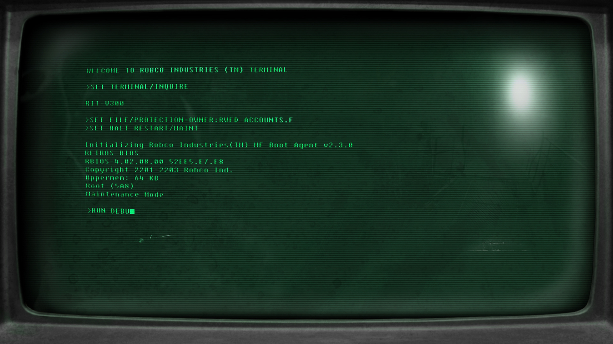

# console-notes

<br/>

------------

❗*You have to have [**Node.js**](https://nodejs.org/en/) installed on your machine to run this project.*

------------

### Console Notes app made with node.js

For getting help type:&nbsp; `node app.js --help` <br/>
For getting current version type:&nbsp; `node app.js --version` <br/>
<br/>

#### How to work with the app:<br/>
  &nbsp;&nbsp;&nbsp;&nbsp;Type:&nbsp;&nbsp;`node app.js` 	&lt;`command`&gt; 	&lt;`options`&gt; &nbsp;&nbsp;*(all commands and options you can get via help)*<br/>
  &nbsp;&nbsp;&nbsp;&nbsp;For example for adding a new note type:
  ```
  node app.js add --title="This is a title of the new note!" --body="This is a text of the note"
  ```

